# Arquitetura Segura: Agents e MCPs com Amazon AgentCore

## Contexto

- Comunicação 100% privada (sem tráfego pela internet)
- **Todos os MCPs são acessados exclusivamente via AgentCore Gateway** (independente do domínio)
- **Comunicação Agent-to-Agent (A2A) direta via AgentCore Runtime com OAuth 2.0**
- Integração com recursos em VPC privada (RDS, ElastiCache, APIs internas)

---

## Tipos de Comunicação

| Protocolo | Propósito | Porta | Via Gateway | Autenticação |
|-----------|-----------|-------|-------------|--------------|
| **MCP** | Agent → Tools | 8000 | **Sempre** | OAuth 2.0 (Cognito M2M) |
| **A2A** | Agent → Agent | 9000 | Não (direto via Runtime) | OAuth 2.0 (Cognito M2M) |

> **Importante**: Todos os MCPs são acessados via AgentCore Gateway, independente do domínio. A comunicação A2A é feita diretamente entre Runtimes.

---

## Definição de Domínios

| Tipo | Descrição | Acesso MCP | Acesso A2A |
|------|-----------|------------|------------|
| **Mesmo domínio** | MCPs/Agents do mesmo produto/time | Via Gateway | Direto (com OAuth) |
| **Domínio diferente (interno)** | MCPs/Agents de outros produtos/times | Via Gateway | Direto via Runtime + OAuth |
| **Domínio diferente (externo)** | Serviços externos (3rd Party MCPs) | Via Gateway | Direto via Runtime + OAuth |

> **Nota**: Todos os MCPs passam pelo Gateway para garantir ponto único de controle, auditoria e governança.

### Por que usar Gateway para todos os MCPs?

| Benefício | Descrição |
|-----------|-----------|
| **Ponto único de controle** | Todas as chamadas MCP passam por um único ponto |
| **Auditoria centralizada** | CloudTrail registra todas as chamadas MCP |
| **Governança** | Time de plataforma controla todas as integrações |
| **Autenticação** | OAuth 2.0 (Cognito) para todos os MCPs |
| **Rate limiting** | Por target |
| **Billing** | Por domínio |
| **Simplicidade** | Um único padrão de acesso para todos os MCPs |

### Por que A2A não usa AgentCore Gateway?

| Aspecto | Explicação |
|---------|------------|
| **Protocolo diferente** | AgentCore Gateway suporta somente MCP, não A2A |
| **Comunicação direta** | A2A usa JSON-RPC 2.0 direto entre Runtimes |
| **OAuth nativo** | A2A tem autenticação OAuth 2.0 built-in no protocolo |
| **Agent Card** | Discovery via `/.well-known/agent-card.json` no Runtime |

---

## Componentes de Autenticação

| Componente | Função | Localização |
|------------|--------|-------------|
| **Keycloak** | Identity Provider (IdP) para usuários | On-premises / VPC |
| **Cognito** | Identity Provider para server-to-server (M2M) | AWS |
| **Axway API Gateway** | API Gateway corporativo | DMZ / Edge |
| **AgentCore Gateway** | Gateway MCP cross-domain | AWS AgentCore |
| **AgentCore Identity** | Credential Provider (OAuth externo) | AWS AgentCore |

### Tipos de Autenticação

| Tipo | Descrição | Uso |
|------|-----------|-----|
| **User Token** | Token OIDC do usuário (Keycloak) | Usuário → Axway → Agent |
| **Machine-to-Machine (M2M)** | Client Credentials OAuth 2.0 (Cognito) | Agent → MCP, Agent → Gateway, Agent → Agent |
| **OAuth Externo** | OAuth via AgentCore Identity | Gateway → Serviços externos |

---

## Matriz de Autenticação por Cenário

| Origem | Destino | Tipo Auth | Token/Credencial | Validação |
|--------|---------|-----------|------------------|-----------|
| Usuário | Axway | User Token (OIDC) | Keycloak JWT | Axway → Keycloak JWKS |
| Axway | Agent | User Token (propagado) | Keycloak JWT | Agent (opcional) |
| Agent | AgentCore Gateway | M2M OAuth | Cognito Client Credentials | Gateway → Cognito JWKS |
| Gateway | MCP (qualquer domínio) | M2M OAuth | Cognito (interno) | MCP → Cognito JWKS |
| Gateway | MCP externo | OAuth Externo | AgentCore Identity | Serviço externo |
| Agent | Agent (A2A) | M2M OAuth | Cognito Client Credentials | Agent → Cognito JWKS |

---

## Fluxo Consolidado de Autenticação

Este diagrama mostra o fluxo completo desde o usuário até MCPs e Agents.

---

## Cenário 1: Agent no EKS + MCP no AgentCore Runtime

### Visão Geral

- **Agents**: Rodam no EKS (seu cluster Kubernetes)
- **Todos os MCPs**: Acessados via AgentCore Gateway (ponto único de controle)
- **A2A**: Comunicação externa via Axway (exposição) ou direta (consumo)

### Arquitetura

### Fluxo de Comunicação

| Passo | Origem | Destino | Via | Autenticação |
|-------|--------|---------|-----|--------------|
| 1 | Agent EKS | Cognito | VPC Endpoint | Client Credentials |
| 2 | Agent EKS | Gateway | VPC Endpoint | Cognito M2M Token |
| 3a | Gateway | MCP (qualquer domínio) | Runtime | Cognito M2M (interno) |
| 3b | Gateway | 3rd Party MCP | Identity | OAuth Token do Parceiro |

> **Nota**: Todos os MCPs (internos e externos) são acessados via Gateway. MCPs internos usam Cognito M2M, MCPs externos usam OAuth do parceiro via Identity.

---

## Cenário 2: Agents e MCPs no AgentCore Runtime

### Visão Geral

- **Agents**: Hospedados no AgentCore Runtime (serverless)
- **Todos os MCPs**: Acessados via AgentCore Gateway
- **A2A**: Comunicação externa via Axway (exposição) ou direta (consumo)
- **Tudo gerenciado pela AWS**

### Arquitetura

---

## Comparação dos Cenários

| Aspecto | Cenário 1 (Agent no EKS) | Cenário 2 (Agent no Runtime) |
|---------|--------------------------|------------------------------|
| **Onde roda o Agent** | EKS (seu cluster) | AgentCore Runtime (AWS) |
| **MCPs (todos)** | Via Gateway | Via Gateway |
| **Gerenciamento do Agent** | Você (K8s) | AWS (serverless) |
| **Escalabilidade** | HPA/KEDA | Automática |
| **Isolamento** | Pod/Namespace | MicroVM por sessão |
| **Customização** | Total | Limitada ao container |
| **Custo fixo** | EKS + VPC endpoints (~$204/mês) | VPC endpoints (~$71/mês) |

### Quando Usar Cada Cenário

| Situação | Recomendação |
|----------|--------------|
| Já tem EKS e quer manter controle | Cenário 1 |
| Quer simplicidade operacional | Cenário 2 |
| Agent precisa de libs/deps específicas | Cenário 1 |
| Precisa de isolamento forte por sessão | Cenário 2 |
| Custo previsível é prioridade | Cenário 1 |
| Escala imprevisível | Cenário 2 |

---

## Propagação de Contexto do Usuário

Para garantir rastreabilidade e auditoria completa, o contexto do usuário deve ser propagado nas chamadas M2M. Existem duas abordagens principais:

### Abordagem 1: Context Headers

Propagar headers com informações do usuário em todas as chamadas.

#### Headers de Contexto

| Header | Propósito |
|--------|-----------|
| **X-On-Behalf-Of** | ID do usuário original |
| **X-User-Email** | Email do usuário |
| **X-User-Roles** | Roles/permissões do usuário |
| **X-Correlation-Id** | UUID único para rastreabilidade E2E |
| **X-Original-Token-Hash** | Hash do token original (integridade) |

#### Fluxo com Context Headers

---

### Abordagem 2: Token Exchange (RFC 8693)

Trocar o user token por um M2M token que já contém claims do usuário no campo `act` (actor).

#### Vantagens do Token Exchange

| Aspecto | Benefício |
|---------|-----------|
| **Segurança** | Claims do usuário assinados no token, não em headers |
| **Padrão** | RFC 8693 é um padrão OAuth 2.0 |
| **Verificável** | Token pode ser validado criptograficamente |
| **Auditoria** | Identidade do Agent E do usuário no mesmo token |

#### Fluxo com Token Exchange

---

### Comparação das Abordagens

| Aspecto | Context Headers | Token Exchange |
|---------|-----------------|----------------|
| **Segurança** | Headers podem ser forjados | Claims assinados no token |
| **Complexidade** | Simples de implementar | Requer suporte a RFC 8693 |
| **Padrão** | Convenção customizada | RFC 8693 OAuth 2.0 |
| **Validação** | Confiança no caller | Verificação criptográfica |
| **Suporte Cognito** | Nativo | Requer configuração adicional |
| **Overhead** | Baixo | Chamada extra ao IdP |

### Quando usar cada abordagem

| Cenário | Recomendação |
|---------|--------------|
| Ambiente interno confiável | Context Headers |
| Compliance rigoroso | Token Exchange |
| Simplicidade operacional | Context Headers |
| Múltiplos IdPs | Token Exchange |
| Alta segurança | Token Exchange |

### Benefícios de ambas abordagens

- ✅ **Auditoria completa**: logs mostram "user123 via crm-agent chamou get_invoices"
- ✅ **Controle de acesso granular** por usuário/role no MCP
- ✅ **Rastreabilidade E2E** com correlation ID
- ✅ **Integridade verificável** com hash do token original (Context Headers) ou assinatura (Token Exchange)

---

## Comunicação Agent-to-Agent (A2A)

### Visão Geral

| Aspecto | Descrição |
|---------|-----------|
| **Protocolo** | JSON-RPC 2.0 sobre HTTP(S) |
| **Porta** | 9000 (padrão AgentCore) |
| **Discovery** | Agent Card em `/.well-known/agent-card.json` |
| **Autenticação** | OAuth 2.0 Bearer Token (Cognito M2M) |
| **Streaming** | Server-Sent Events (SSE) |

> **Importante**: A2A é sempre DIRETO entre Agents. Não usa AgentCore Gateway.

---

### Tipos de Comunicação A2A

| Tipo | Descrição | Autenticação | Gateway |
|------|-----------|--------------|---------|
| **Interno (mesmo domínio)** | Agents do mesmo produto/time | Cognito M2M | Não |
| **Intra-domínios** | Agents de domínios diferentes internos | Cognito M2M + Scopes | Não |
| **Externo - Consumo** | Seu Agent chama Agent 3rd Party | OAuth do Parceiro | Não |
| **Externo - Exposição** | Agent 3rd Party chama seu Agent | Cognito M2M | **Axway obrigatório** |

---

### Fluxo A2A Unificado

Visão consolidada de todos os cenários A2A, independente de onde os Agents rodam (EKS ou AgentCore Runtime).

---

### Matriz de Cenários A2A

| Cenário | Agent Origem | Agent Destino | Autenticação | Gateway | Observação |
|---------|--------------|---------------|--------------|---------|------------|
| Interno mesmo domínio | Domínio A | Domínio A | Cognito M2M | Não | Comunicação interna |
| Intra-domínios | Domínio A | Domínio B | Cognito M2M + Scopes | Não | Scopes controlam acesso cross-domain |
| Consumo externo | Interno | 3rd Party | OAuth do Parceiro | Não | Credenciais registradas no parceiro |
| **Exposição externa** | 3rd Party | Interno | Cognito M2M | **Axway obrigatório** | Segurança na borda |

### Controle de Acesso A2A por Scopes

| Scope | Descrição | Exemplo |
|-------|-----------|---------|
| `a2a-{agent}/read` | Leitura no agent do mesmo domínio | `a2a-finance/read` |
| `a2a-{agent}/write` | Escrita no agent do mesmo domínio | `a2a-finance/write` |
| `a2a-{agent}/read:{dominio}` | Leitura cross-domain | `a2a-hr/read:dominio-b` |
| `a2a-{agent}/write:{dominio}` | Escrita cross-domain | `a2a-hr/write:dominio-b` |

> **Importante**: Para exposição de Agents a parceiros externos (3rd Party), o tráfego deve obrigatoriamente passar pelo Axway API Gateway para garantir:
> - Controle de acesso na borda (DMZ)
> - Rate limiting por parceiro
> - Auditoria centralizada
> - Proteção contra ataques (WAF, DDoS)

---

## Controle de Acesso por Domínio

### Matriz de Acesso

| Agent | MCPs via Gateway |
|-------|------------------|
| crm-agent | mcp-crm-customers, mcp-crm-leads, finance-invoices, hr-employees, 3rdparty-mcp |
| finance-agent | mcp-finance-invoices, mcp-finance-payments, crm-customers, 3rdparty-mcp, jira-mcp |
| hr-agent | mcp-hr-employees, mcp-hr-payroll, finance-payments, 3rdparty-mcp |

> **Nota**: Todos os MCPs são acessados via Gateway. O controle de acesso é feito via OAuth scopes no Cognito.

---

## Diagrama Final: Cadeia Completa

---

## Comparação: Gateway Obrigatório

| Aspecto | Descrição |
|---------|-----------|
| **Todos os MCPs** | Agent → Gateway → MCP |
| **Auditoria** | Completa (todos os MCPs) |
| **Ponto de controle** | Centralizado |
| **Padrão único** | Simplicidade operacional |

### Benefícios do Gateway Obrigatório

| Cenário | Benefício |
|---------|-----------|
| Compliance rigoroso (SOX, PCI) | ✅ Auditoria centralizada |
| Múltiplos times/domínios | ✅ Governança unificada |
| Simplicidade operacional | ✅ Um único padrão de acesso |
| Controle de custos | ✅ Billing centralizado por domínio |

---

## Policies sem AgentCore Gateway

> **Observação importante**: As policies do AgentCore estão integradas ao ecossistema de serviços, especialmente ao Gateway. Sem o Gateway, você perde a camada de governança centralizada para ferramentas/tools.

| Cenário | Solução sem Gateway |
|---------|---------------------|
| Controle de acesso a recursos AWS | IAM policies tradicionais |
| Filtragem de conteúdo | Bedrock Guardrails |
| Controle de tools/MCPs | Implementar manualmente no código do agente |
| Auditoria | CloudWatch + CloudTrail |
| Rate limiting por tool | Implementar no código ou usar API Gateway |

**Resumo**: O Gateway é o ponto onde as policies de ferramentas são aplicadas de forma centralizada. Sem ele, você precisa implementar esses controles de forma distribuída no seu código ou usar mecanismos nativos da AWS (IAM, Guardrails).

---

## Custos Estimados

### Cenário 1: Agent no EKS

| Componente | Custo/mês |
|------------|-----------|
| EKS Cluster | ~$73 |
| EC2 Nodes (2x t3.medium) | ~$60 |
| VPC Endpoints (AgentCore + Gateway) | ~$28 |
| VPC Endpoints auxiliares | ~$43 |
| AgentCore Runtime (MCPs) | Variável |
| **Total fixo** | **~$204/mês** |

### Cenário 2: Agent no Runtime

| Componente | Custo/mês |
|------------|-----------|
| VPC Endpoints (AgentCore + Gateway) | ~$28 |
| VPC Endpoints auxiliares | ~$43 |
| AgentCore Runtime (Agent + MCPs) | Variável |
| **Total fixo** | **~$71/mês** |

---

## Resumo

### Princípios de Comunicação

| Tipo | Caminho | Autenticação |
|------|---------|--------------|
| **MCP (qualquer domínio)** | Agent → Gateway → MCP | OAuth M2M (Cognito) |
| **MCP externo** | Agent → Gateway → Identity → Serviço | OAuth Externo |
| **A2A** | Agent → Agent (direto) | OAuth M2M (Cognito) |

### Garantias

- ✅ Comunicação 100% privada via VPC Endpoints
- ✅ Auditoria completa via CloudTrail (todos os MCPs via Gateway)
- ✅ Controle de acesso centralizado via OAuth scopes
- ✅ Rastreabilidade E2E via Correlation ID
- ✅ Isolamento por sessão (MicroVM no Runtime)
- ✅ Ponto único de controle para todos os MCPs

---

## Diagramas: Todos os MCPs via Gateway

Neste modelo, **todos os MCPs são acessados exclusivamente via AgentCore Gateway**. Isso garante:
- Ponto único de controle e auditoria
- Políticas centralizadas para todos os MCPs
- Simplificação da arquitetura de rede

---

### Cenário 1: Agent no Runtime - Gateway Obrigatório

Cenário serverless onde todos os MCPs passam pelo Gateway.

---

### Cenário 2: Agent no EKS - Gateway Obrigatório

Cenário híbrido com Agent no EKS onde todos os MCPs passam pelo Gateway via VPC Endpoint.

---

### Legenda dos Diagramas

| Componente | Função | Autenticação |
|------------|--------|--------------|
| **Keycloak** | IdP para usuários | OIDC Authorization Code |
| **Axway** | API Gateway corporativo | Valida User Token |
| **Cognito** | IdP para M2M | Client Credentials |
| **AgentCore Gateway** | Gateway MCP - ponto único | OAuth M2M Cognito |
| **AgentCore Identity** | Credential Provider | OAuth para serviços externos |
| **VPC Endpoint** | Conectividade privada EKS para AgentCore | PrivateLink |

| Tipo de Comunicação | Via Gateway | Autenticação |
|---------------------|-------------|--------------|
| MCP (qualquer domínio) | **SIM** | Cognito M2M |
| MCP externo | **SIM** | OAuth via Identity |
| A2A Agent para Agent | NÃO - direto | Cognito M2M |

---

## Multi-Region Latency Considerations

### Scenario: Distributed Architecture Brazil + USA

| Component | Region | Location |
|-----------|--------|----------|
| **Agents (EKS)** | sa-east-1 | São Paulo |
| **Microservices (EKS)** | sa-east-1 | São Paulo |
| **AgentCore Runtime** | us-east-1 | N. Virginia |
| **AgentCore Gateway** | us-east-1 | N. Virginia |
| **MCPs (AgentCore Runtime)** | us-east-1 | N. Virginia |

### Estimated Latency per Segment

| Segment | Latency |
|---------|---------|
| São Paulo ↔ N. Virginia | ~100-150ms RTT |
| Within sa-east-1 | ~1-5ms RTT |
| Within us-east-1 | ~1-5ms RTT |

---

### Diagram: Cross-Region Roundtrip

```mermaid
sequenceDiagram
    participant User as User - Brazil
    participant Agent as Agent EKS - sa-east-1
    participant Gateway as AgentCore Gateway - us-east-1
    participant MCP as MCP Runtime - us-east-1
    participant Microservice as Microservice EKS - sa-east-1
    
    Note over User,Microservice: ESTIMATED LATENCIES PER SEGMENT
    
    rect rgb(255, 243, 224)
        Note over User,Agent: Brazil - Low latency ~5-20ms
        User->>Agent: Request
    end
    
    rect rgb(255, 205, 210)
        Note over Agent,Gateway: Cross-Region ~100-150ms RTT
        Agent->>Gateway: invoke_gateway + M2M Token
        Note right of Agent: 🌐 São Paulo → N. Virginia
    end
    
    rect rgb(200, 230, 201)
        Note over Gateway,MCP: Same Region ~1-5ms
        Gateway->>MCP: tools/call
    end
    
    rect rgb(255, 205, 210)
        Note over MCP,Microservice: Cross-Region ~100-150ms RTT
        MCP->>Microservice: API Call
        Note right of MCP: 🌐 N. Virginia → São Paulo
        Microservice-->>MCP: Response
        Note left of Microservice: 🌐 São Paulo → N. Virginia
    end
    
    rect rgb(200, 230, 201)
        Note over Gateway,MCP: Same Region ~1-5ms
        MCP-->>Gateway: Result
    end
    
    rect rgb(255, 205, 210)
        Note over Gateway,Agent: Cross-Region ~100-150ms RTT
        Gateway-->>Agent: Result
        Note left of Gateway: 🌐 N. Virginia → São Paulo
    end
    
    rect rgb(200, 230, 201)
        Note over Agent,User: Brazil - Low latency ~5-20ms
        Agent-->>User: Response
    end
```

---

### Diagram: Total Latency Breakdown per MCP Call

---

### Table: Latency Impact per Call Pattern

| Pattern | MCP Calls | Cross-Region RTTs | Total Latency |
|---------|-----------|-------------------|---------------|
| Sequential | 1 | 2x RTT (Agent↔Gateway + MCP↔Microservice) | ~300-450ms |
| Sequential | 3 | 6x RTT | ~900-1350ms |
| Sequential | 5 | 10x RTT | ~1500-2250ms |
| **Parallel** | 3 | **2x RTT** | **~300-450ms** |
| **Parallel** | 5 | **2x RTT** | **~300-450ms** |

---

### Recommendations to Minimize Latency

| Strategy | Description | Reduction |
|----------|-------------|-----------|
| **Parallel calls** | Execute independent MCPs in parallel | Up to 70% |
| **Batch operations** | Group multiple operations in a single call | 50-70% |
| **Local cache** | Cache frequent data in Agent | Variable |
| **Colocate MCPs with Microservices** | Run MCPs in sa-east-1 when available | ~50% |

### Trade-offs: Architecture Decisions

| Scenario | Agent→Gateway | MCP→Microservice | Total per Call | Recommendation |
|----------|---------------|------------------|----------------|----------------|
| Current (MCPs in us-east-1) | ~100-150ms | ~100-150ms | ~300-450ms | Use parallel calls |
| Future (MCPs in sa-east-1) | ~100-150ms | ~1-5ms | ~200-310ms | Better for microservice-heavy workloads |
| All in us-east-1 | ~1-5ms | ~1-5ms | ~10-20ms | Best latency, but users in Brazil affected |

> **Note**: The main latency bottleneck is the double cross-region hop: Agent→Gateway (sa-east-1→us-east-1) and MCP→Microservice (us-east-1→sa-east-1). Parallel calls are essential to minimize total response time.
